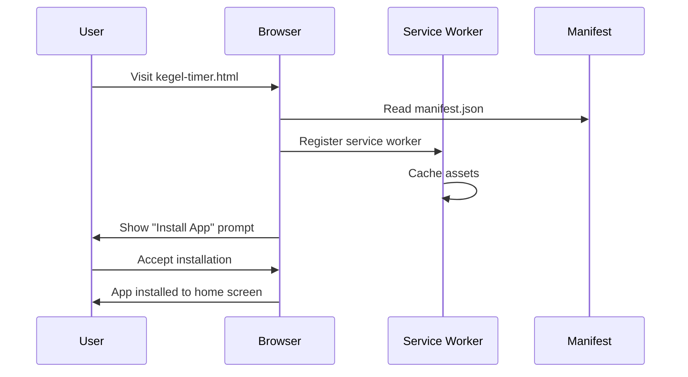
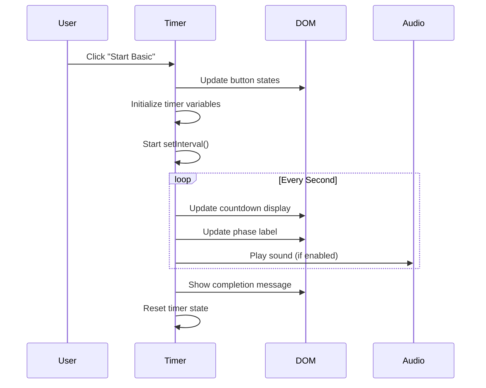

# 📝 Project Overview: Dual-Purpose GitHub Pages Site

> **Technical explanation of the Kegel Timer & Developer Hub project architecture**

## 📋 Explanation Request

Please provide a technical explanation for the following code/feature/issue:

---
**Dual-purpose GitHub Pages site combining a professional developer hub with a Progressive Web App (PWA) Kegel exercise timer, built using vanilla JavaScript with minimal direct code manipulation.**
---

## 1. WHY: Context and Reasoning

### Problem Solved
- **Dual Purpose**: Combines professional portfolio with functional health app
- **AI-Assisted Development**: Exploration of minimal direct code manipulation using AI tools
- **PWA Benefits**: Offline functionality, installable app, native-like experience
- **Defensive Coding**: Robust error handling for AI-generated code

### Technical Decisions
- **Vanilla JavaScript**: No build tools, direct browser compatibility
- **Panel-Based Navigation**: Consistent UI pattern across both applications
- **Custom Test Framework**: Browser-based testing without external dependencies
- **LocalStorage**: Simple persistence without backend requirements

## 2. HOW: Component Interactions and Process Flow

### Application Structure
```
├── index.html + hub.js     → Developer Portfolio Hub
├── kegel-timer.html + script.js → Timer PWA Application
├── styles.css              → Shared styling
├── manifest.json + sw.js   → PWA infrastructure
└── tests/                  → Custom test framework
```

### Panel Navigation Flow
```
User clicks navigation button
    ↓
hideAllPanels() called
    ↓ 
Target panel.style.display = 'block'
    ↓
Application state preserved
```

### Timer Exercise Flow
```
User selects exercise type
    ↓
startExercise(holdTime, relaxTime, reps)
    ↓
setInterval() timer started
    ↓
updateTimerVisuals() called each second
    ↓
Phase transitions: HOLD → RELAX → repeat
    ↓
Exercise completion or manual stop
```

## 3. DIAGRAM: Sequence of Operations

### PWA Installation Flow


### Exercise Timer Sequence


## 4. ROLES: Component Responsibilities

### Core Files
- **`index.html`**: Developer hub entry point and structure
- **`hub.js`**: Portfolio navigation and panel management
- **`kegel-timer.html`**: Timer app entry point with PWA links
- **`script.js`**: Timer logic, exercise routines, progress tracking
- **`styles.css`**: Shared responsive styling for both apps

### PWA Infrastructure
- **`manifest.json`**: App metadata, icons, display settings
- **`sw.js`**: Service worker for offline caching
- **`icons/`**: PWA icons in multiple sizes

### Testing System
- **`test-framework.js`**: Custom browser-based test runner
- **`test-runner.html`**: Test execution interface
- **`unit/`**: Individual component tests
- **`integration/`**: Full user flow tests

### Development Tools
- **`.vscode/launch.json`**: Chrome debugging configurations
- **`.vscode/tasks.json`**: Development server tasks
- **`debug-tests.bat`**: Quick test server startup

## 5. BEST PRACTICES: Patterns and Gotchas

### Defensive Coding Pattern
```javascript
// GOOD: Always check for element existence
if (element) {
    element.addEventListener('click', handler);
}

// BAD: Assumes element exists
element.addEventListener('click', handler);
```

### Panel Navigation Pattern
```javascript
function hideAllPanels() {
    // Hide all panels before showing target
    if (panel1) panel1.style.display = 'none';
    if (panel2) panel2.style.display = 'none';
}
// Then show specific panel
if (targetPanel) targetPanel.style.display = 'block';
```

### LocalStorage Usage
```javascript
// Always provide fallback values
const count = parseInt(localStorage.getItem('todayCount') || '0');

// Store as strings (localStorage requirement)
localStorage.setItem('todayCount', String(count));
```

### PWA Gotchas
- Service worker scope limited to directory level
- Cache updates require version bumping in `sw.js`
- Manifest changes need app reinstallation
- HTTPS required for service workers (except localhost)

### Testing Patterns
- Mock localStorage for isolated tests
- Mock timers to avoid async complexity
- Clean up DOM after each test
- Use defensive checks in test assertions

## Implementation Notes

This project demonstrates AI-assisted development with minimal direct code manipulation, emphasizing robust defensive coding patterns and comprehensive testing for maintainability.
